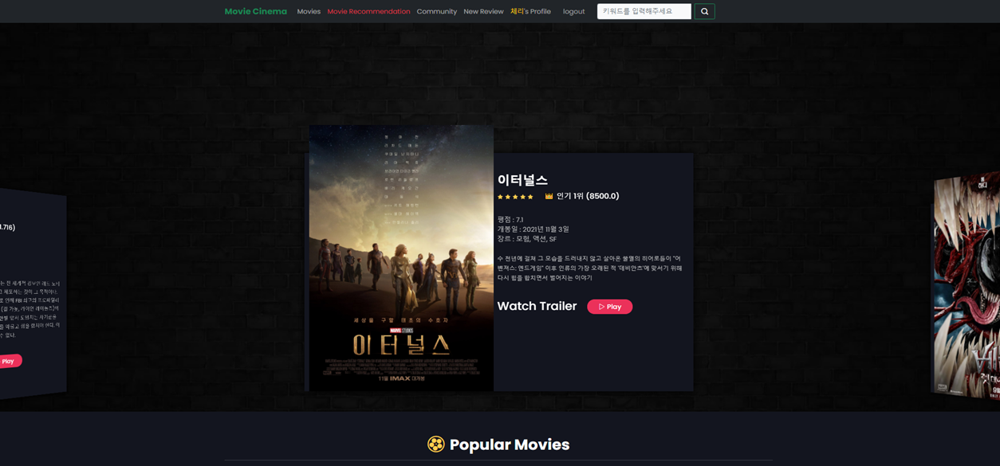
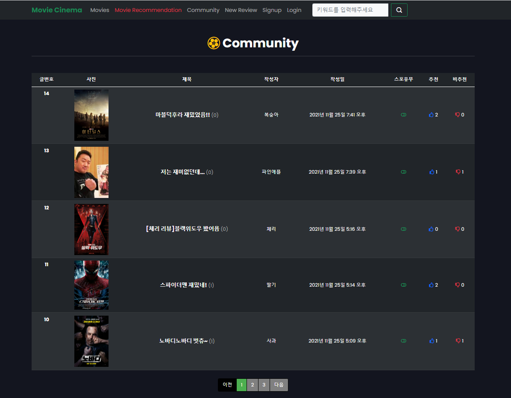
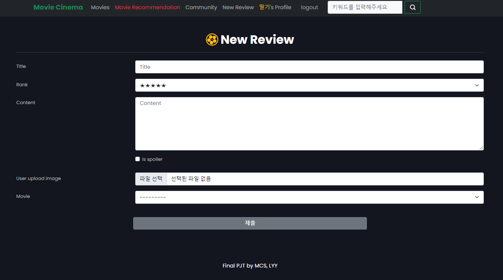
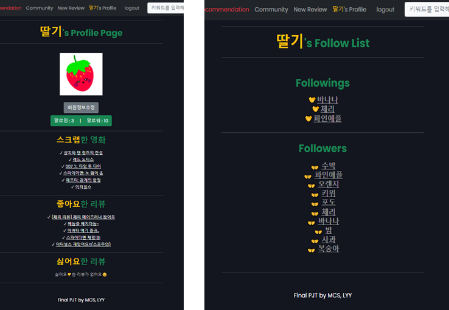
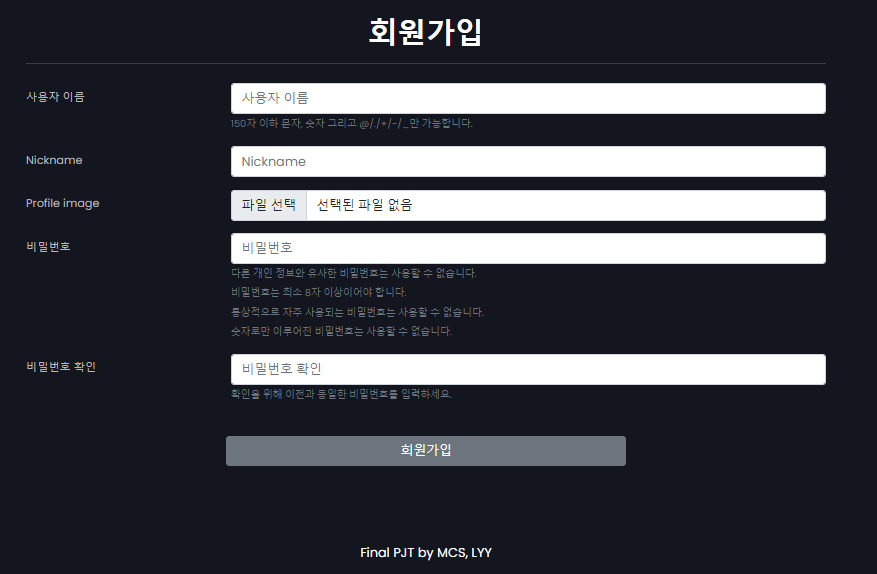
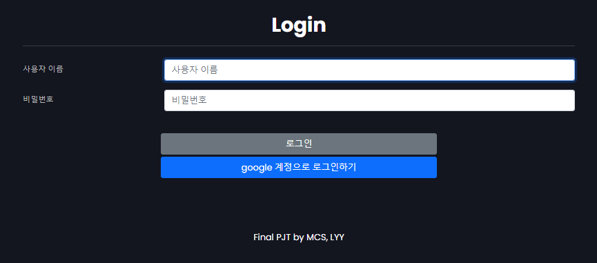

# 🎞️Movie Cinema

​																																			(기간: 2021.11.17 ~ 11.25)

----


# README

1. 가상환경을 만들고, 적용시켜 주세요

```
$ python -m venv venv
$ source venv/Scripts/activate
```

2. requirements.txt를 설치해주세요

```
$ pip install -r requirements.txt
```

3. 실행시켜 주세요!!!

```
$ python manage.py runserver
```

4. 처음 페이지를 로딩했을 때, 깨져보인다면 새로고침 한번 꼬옥 눌러주세요!!😊

---


# 🍹최종 완성본

### ✔ 메인 페이지




✔ 전체조회 페이지(제목순, 최신순, 인기순, 평점순, 스크랩 많은순)


### ✔ 영화추천 페이지(제목순, 인기순, 평점순, 최신순)

- 비로그인 : 랜덤추천
- 로그인 & 스크랩 x : 랜덤추천
- 로그인 & 스크랩 o : 스크랩영화 기반 추천


### ✔ 커뮤니티 페이지

- 업로드 이미지 없을 시, 영화포스터 가져옴
- 스포유무 표시 
- 추천, 비추천 기능
- 댓글 기능



- 디테일 페이지


- 새로운 리뷰 작성 페이지




### ✔ 프로필 페이지




### ✔ 검색기능


### ✔ 회원가입 페이지




### ✔ 로그인 페이지

- 구글 계정으로 소셜 로그인 가능



